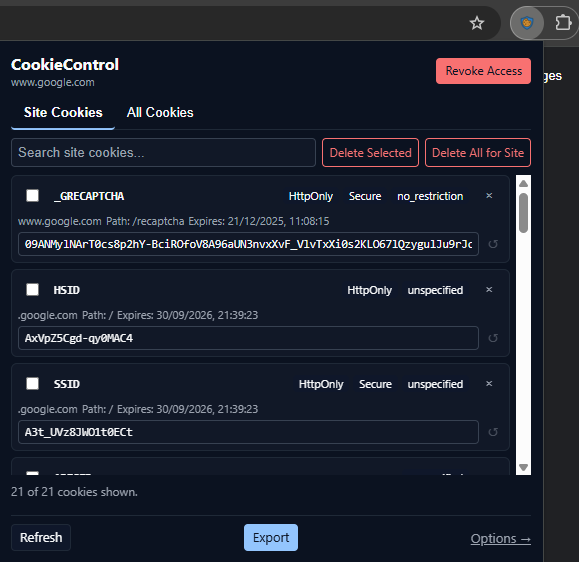
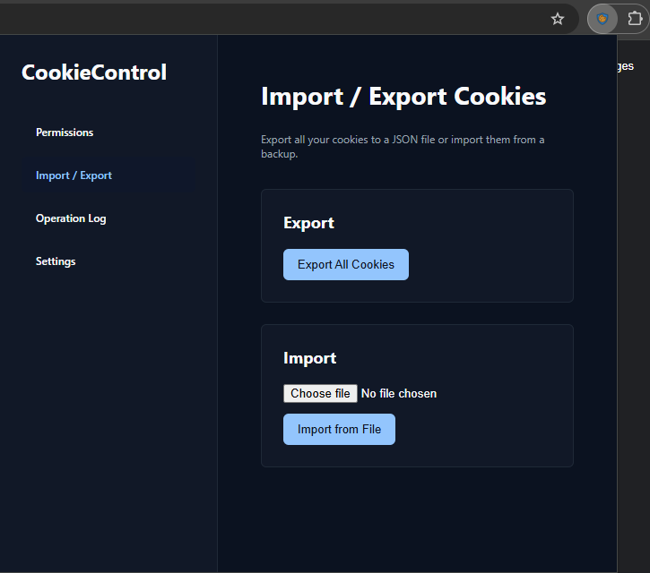

# CookieControl — Privacy-first Cookie Manager (Chrome MV3)

A lightweight, privacy-first Chrome extension to view, edit, delete, import/export and bulk-manage cookies.

## Highlights

- **Modern, Intuitive UI**: Cookies are now grouped by their base domain (e.g., `google.com`), decluttering the view by consolidating subdomains and API endpoints.
- **Streamlined Permissions**: Permission-on-demand is now based on the base domain, providing a more consistent and predictable experience.
- **MV3 Service Worker**: Built on the modern Manifest V3 platform for better performance and security.
- **Local-first**: No network requests or telemetry. All your data stays on your machine.
- **Import/Export**: Easily back up and restore cookies as JSON files.
- **Dual Interface**: Use the lightweight popup for quick access to the current tab's cookies or the full options page for advanced management.

## Requirements
- Google Chrome / Microsoft Edge (v121+) **or** Firefox (v119+)
- Node.js ≥ 18 LTS & npm (only required for building or running Firefox tooling)
## Quick Install (Developer)
1. Clone or download this repository to a local folder.
2. In Chrome, navigate to `chrome://extensions/`.
3. Enable **Developer mode** (usually a toggle in the top-right corner).
4. Click **Load unpacked** and select the project's root folder.
5. (Firefox) Run `npm run run:firefox` to launch a temporary build in Firefox Developer Edition.

## Quick-start (Firefox)

1. Clone or download this repository to a local folder.
2. Install dependencies: `npm install`
3. Run in Firefox temporarily: `npm run run:firefox`
4. Load the extension in Firefox by visiting `about:debugging`, clicking "This Firefox" and then "Load Temporary Add-on". Select any file within the project's root folder.

## Usage

Once installed, click the CookieControl icon next to the address bar.

- **View cookies**: The popup lists cookies for the current site, grouped by base domain.
- **Edit/delete**: Click a cookie row to edit its attributes or hit the trash icon to delete.
- **Bulk actions**: Use the Options page for import/export or to delete all cookies for a domain.
- **Grant access**: If you see a locked icon, click "Grant" to allow access for the site.

## 📸 Screenshots

| Popup | Options |
|-------|---------|
|  |  |

<!-- Place your images in docs/screenshots/ and keep the same filenames -->

## Build & Packaging

We stage minimal source trees for each browser to keep bundles lean and privacy-focused (no dev files, tests, or docs shipped).

Commands:

```bash
# Clean previous artifacts
npm run clean

# Chromium (staging in dist/chromium, build zip in dist/)
npm run build:chromium

# Firefox (staging in dist/firefox, build zip in dist/)
npm run build:firefox

# Optional: run in Firefox from slim staging
npm run run:firefox
```

How it works:

- `scripts/prepare-chromium.js` and `scripts/prepare-firefox.js` copy only necessary files to `dist/chromium` and `dist/firefox`.
- Dev-only content is excluded: `docs/`, `tests/`, `scripts/`, `.github/`, `.windsurf/`, `*.md`, etc.
- Deprecated files (like `src/permissions/`) are excluded from staging.
- `.web-extignore` further guards against accidental inclusion when packaging.

## Manifest Strategy (Base + Overlays)

- **Base (`manifest.json`)**: Default Chrome/Chromium MV3 manifest. This is the canonical source for shared fields.
- **Overlays**: Browser-specific files that contain only what differs from the base manifest:
  - `manifest.firefox.json` – overrides background to a page (`src/background.html`) and adds `browser_specific_settings.gecko`.
  - `manifest.edge.json` (optional) – only if Edge requires overrides (e.g., `browser_specific_settings`), otherwise Edge uses the base as-is.

During staging/build:

- Chromium-family: `scripts/prepare-chromium.js [target]` deep-merges `manifest.json` with `manifest.<target>.json` if present (e.g., `manifest.edge.json`), and writes the result to `dist/<target>/manifest.json`.
- Firefox: `scripts/prepare-firefox.js` deep-merges `manifest.json` with `manifest.firefox.json` and writes to `dist/firefox/manifest.json`.

This keeps Chrome/Chromium as the default baseline while making Firefox/Edge differences explicit, minimal, and easy to maintain.

### Add another browser

1. Create an overlay file at the project root named `manifest.<browser>.json` containing only the fields that differ from `manifest.json`.
2. Build using the target:
   - `node scripts/prepare-chromium.js <browser>` → stages to `dist/<browser>/` with merged manifest
   - Then: `web-ext build -s dist/<browser> -a dist --overwrite-dest`
3. If a browser needs non-Chromium APIs (like Firefox background page), add only those deltas to the overlay.

## File Structure

```plaintext
cookie-control/
├── manifest.json
├── README.md
├── package.json
└── src/
    ├── background.js                # MV3 service worker – RPC & cookie plumbing
    ├── utils/
    │   ├── chrome.js                # Promise-based wrappers around Chrome APIs
    │   ├── dom.js                   # Lightweight DOM helpers ($ / $$)
    │   └── cookieUtils.js           # Pure helpers for cookie & permission logic
    ├── popup/
    │   ├── popup.html
    │   ├── popup.css
    │   └── popup.js                 # Quick-access UI for current tab
    └── options/
        ├── options.html
        ├── options.css
        └── options.js               # Advanced management UI
```

## Architecture Overview

The extension is split into three clearly-defined layers:

1. **Shared Utilities** (`src/utils/*`)
   - `dom.js` – Tiny DOM wrapper (`$`, `$$`) reused by every page.
   - `chrome.js` – Centralised, promise-based wrappers for all Chrome APIs (storage, cookies, permissions, tabs). This eliminates duplicated plumbing code.
   - `cookieUtils.js` – Pure, stateless helpers for cookie → URL transforms, base-domain maths and permission patterns.

2. **Background Service Worker** (`background.js`)
   Handles all privileged operations: cookie CRUD, permission logic, import/export and maintains an in-memory operation log. It relies solely on the shared utilities.

3. **UI Layers**
   - `popup/` – Minimal interface for the current tab. Requires only site-level permissions.
   - `options/` – Full management dashboard with import/export and granular permission controls.
   Both UIs share the same reactive store (`utils/state.js`) for settings persistence.

This modular layout keeps each file focused and makes new features (e.g., a rules engine) trivial to add by composing the existing helpers.

## Security & Privacy

- **Minimal Permissions**: The extension requests host permissions only when you need them. Site-specific access is granted for the base domain to cover related subdomains.
- **Local Processing**: All cookie operations happen locally within the extension. No data is ever sent to external servers.
- **User Control**: You have full control to revoke permissions and clear any stored data at any time via the options page.

## Roadmap

- [ ] Add support for more import/export formats (e.g., Netscape `cookies.txt`).
- [ ] Implement cookie purpose detection and flagging of common trackers.
- [ ] Introduce automation rules for cookie management (e.g., auto-delete on tab close).
- [ ] Add comprehensive unit and integration tests (e.g., with Puppeteer).
- [x] Enhance UI/UX for better clarity and organization (partially complete).

## Contributing

PRs welcome! For major changes please open an issue first to discuss what you would like to change.

## License

[MIT](LICENSE)

## References

- [Chrome Extension Documentation](https://developer.chrome.com/docs/extensions/)
- [Manifest V3 Overview](https://developer.chrome.com/docs/extensions/mv3/intro/)
- [chrome.cookies API](https://developer.chrome.com/docs/extensions/reference/cookies/)

## 🌍 Cross-Browser Support

This project now runs on Chromium-based browsers and Firefox.

- **Chromium (Chrome/Edge/Brave/Opera)**
  - Use the default `manifest.json`.
  - Load unpacked from the project root as usual (`chrome://extensions` → Developer Mode → Load unpacked).

- **Firefox (MV3)**
  - Requires Node.js for tooling.
  - Install dependencies once: `npm install`
  - Run in Firefox temporarily: `npm run run:firefox`
    - This uses `web-ext` to prepare `dist/firefox/` (copies sources and swaps `manifest.firefox.json` → `manifest.json`) and launches Firefox.
  - Build a signed-ready bundle: `npm run build:firefox` (outputs ZIP under `dist/`).
  - Background is a page (`src/background.html`) that loads `src/background.js` as an ES module.

### Permissions UX

- **Requesting site access**
  - Chromium: requested directly from the popup (`src/popup/popup.html` → `popup.js`). The browser shows the permission prompt over the popup.
  - Firefox: the popup routes you to the Options page (`chrome.runtime.openOptionsPage()`), which shows a grant banner. Clicking "Grant" triggers `permissions.request()` from a top-level extension page so the doorhanger is reliably shown.
    - Pending origins are passed via `chrome.storage` under `cookiecontrol:pending-origins`.
    - The Options page performs batch request with per-origin fallback and updates the UI on success.

### Permissions & APIs

- Uses on-demand host permissions via `optional_host_permissions` and the `permissions` API.
- Popup requests/revokes site/global access at runtime on Chromium.
- On Firefox, popup forwards grant to the Options page to ensure the permission doorhanger is visible and tied to a user gesture.
- `src/utils/chrome.js` wraps callback-style `chrome.*` APIs with Promises—compatible with Chromium and Firefox.
- Service worker (Chromium) vs background page (Firefox) differences are handled by using `chrome.runtime.onInstalled` for initialization and avoiding SW-only globals.

### Safari

- Safari requires converting to a Safari Web Extension via Xcode. The current code base is compatible with that flow, but packaging is not included here.
